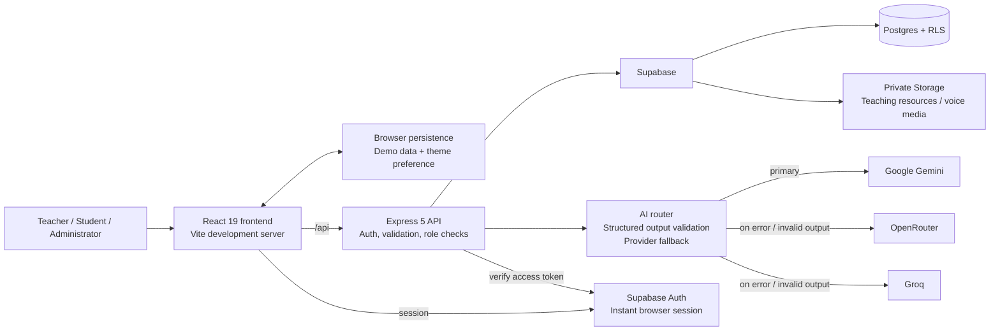
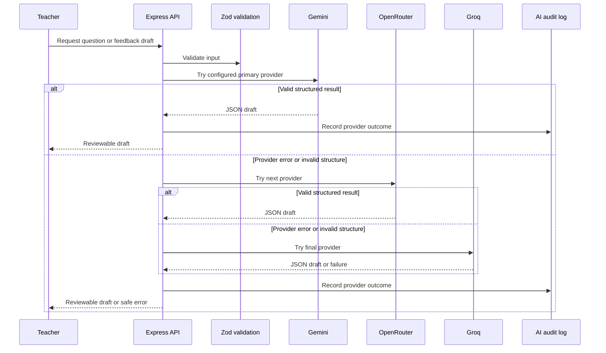
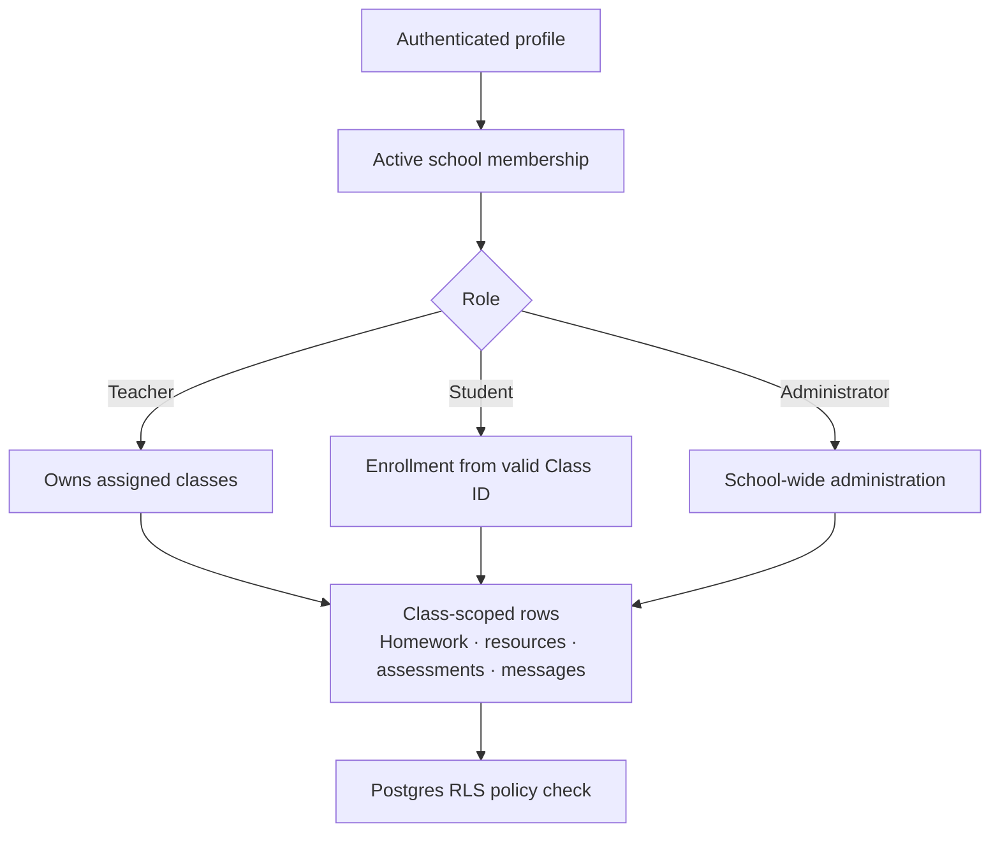

# TeachMate

<p align="center">
  
</p>

<p align="center">
  <strong>An AI-assisted classroom workspace for teachers, students, and school administrators.</strong>
</p>

<p align="center">
  <a href="#quick-start">Quick start</a> &middot;
  <a href="#architecture">Architecture</a> &middot;
  <a href="#ai-system">AI system</a> &middot;
  <a href="#supabase-data-and-security">Security</a> &middot;
  <a href="#openai-build-week">OpenAI Build Week</a>
</p>

<p align="center">
  
  
  
  
  
  
  
</p>

> [!IMPORTANT]
> This README reflects the repository as it exists today. TeachMate is a **JavaScript** application using **React, Vite, Express, and CSS**. Python, FastAPI, TypeScript, Tailwind CSS, Redis, Docker, Docker Compose, OCR, WebSockets, and a custom JWT secret are **not currently implemented** in this repository. They are listed in the [roadmap](#roadmap) only where relevant.

<!-- Replace this placeholder with an exported product screenshot or banner at docs/screenshots/teachmate-banner.png. -->


## Table of contents

- [Why TeachMate](#why-teachmate)
- [What it does](#what-it-does)
- [Screenshots](#screenshots)
- [Architecture](#architecture)
- [Technology stack](#technology-stack)
- [Project structure](#project-structure)
- [Quick start](#quick-start)
- [Configuration](#configuration)
- [AI system](#ai-system)
- [Quiz and assessment workflow](#quiz-and-assessment-workflow)
- [Supabase data and security](#supabase-data-and-security)
- [API reference](#api-reference)
- [Persistence and demo mode](#persistence-and-demo-mode)
- [Performance and reliability](#performance-and-reliability)
- [OpenAI Build Week](#openai-build-week)
- [Roadmap](#roadmap)
- [Contributing](#contributing)
- [License](#license)

## Why TeachMate

Teaching work is usually fragmented: class lists, homework, feedback, resources, messages, and school notices live in separate places. TeachMate brings those workflows into one role-aware workspace while keeping the most important boundary explicit: **every class has a persistent Class ID, and class-scoped data stays inside that class.**

The application supports three experiences:

| Role | Primary workflow |
| --- | --- |
| **Teacher** | Create and manage classes, share Class IDs, work with class-scoped homework/resources/messages, use AI to draft assessments and feedback, and view cross-class insights. |
| **Student** | Join a teacher’s class with its Class ID, then work from a subject-specific space for tests, feedback, resources, announcements, and progress. |
| **School administrator** | Manage school-level teachers, classes, subject information, announcements, profiles, reporting, and school-wide analytics. |

## What it does

### Classroom management

- Persistent, unique class join codes in the `TM-...` format.
- Teachers create their own classes and can maintain multiple classes from one dashboard.
- Students join only through a valid teacher-shared Class ID.
- A selected class changes the available navigation to class-scoped tools; leaving it returns to teacher-wide or student-wide tools.
- Class management records ownership, student enrollment, and teacher assignment.

### Teacher workspace

- Teacher dashboard with class cards, join codes, progress, and quick navigation.
- Class-specific pages for students, homework, attendance, assessments, feedback, resources, and messages.
- Homework creation and assignment persistence.
- Class-scoped resource uploads through Supabase Storage and signed download URLs.
- Teacher-wide timetable, calendar, announcements, messaging, profile, settings, insights, and analytics views.
- Light/dark themes with saved user preference.

### Student workspace

- Subject cards for every class in which the student is enrolled.
- Subject-specific progress, tests, and feedback.
- A calendar generated from the student’s real dated homework, assessments, quizzes, and classes.
- Access to resources assigned to that class only.
- Announcements targeted to students or to the whole school.
- Persistent sign-in state until the user explicitly signs out.

### Administrator workspace

- School overview and school profile details.
- Teacher and class management, with each class showing its teacher and enrolled student count.
- Class-first student roster management rather than a disconnected student directory.
- Targeted announcements for **teachers**, **students**, or **everyone**.
- School-wide learning indicators and report/analytics views.

### AI-assisted teaching

- **AI quiz generation** creates structured question drafts from subject, chapter, grade, marks, difficulty, and question-type inputs. Each draft includes questions, correct answers, explanations, and learning topics for teacher review before it is published.
- Quiz diagnostics turn recorded student attempts into class and individual performance views, including topic accuracy, question difficulty, common mistakes, and revision guidance. They do not invent submission data when no learner has attempted a quiz.
- **Ask AI** is available throughout the workspace in chat and voice modes. It sends the current authenticated role, page, active class, and only authorized Supabase records to the server before a provider is called.
- Ask AI streams its answer, identifies the active provider, and switches from Gemini to OpenRouter to Groq if a provider fails.
- Ask AI is instructed to use verified records only: it does not fabricate student names, marks, attendance, submissions, or percentages when that data is unavailable.
- Assessment feedback can be recorded with the browser microphone and delivered as the teacher’s original audio to one enrolled student. This path does **not** transcribe, summarize, grade, or send the recording to an AI model.
- Server-side model routing with provider fallback:
  **Gemini → OpenRouter → Groq** by default.
- Output validation before an AI draft reaches the application.
- AI audit records designed to retain request metadata rather than raw prompts.
- Teacher-in-the-loop language: AI prepares a draft; the teacher decides what is used.

## Screenshots

The application includes polished light and dark mode screens. Add exported images to `docs/screenshots/` to replace the intentionally portable placeholders below.

| View | Placeholder |
| --- | --- |
| Onboarding and role selection | `docs/screenshots/onboarding.png` |
| Teacher class dashboard | `docs/screenshots/teacher-classes.png` |
| Class workspace | `docs/screenshots/class-workspace.png` |
| Student subjects | `docs/screenshots/student-subjects.png` |
| Administrator console | `docs/screenshots/admin-dashboard.png` |

```text
docs/
└── screenshots/
    ├── onboarding.png
    ├── teacher-classes.png
    ├── class-workspace.png
    ├── student-subjects.png
    └── admin-dashboard.png
```

## Architecture



### Request lifecycle

1. The React client restores a Supabase session (or a browser-only demo workspace).
2. Authenticated requests pass a Supabase access token to Express.
3. Express validates the token, resolves the active school membership, and enforces role and class access.
4. Supabase Row Level Security (RLS) applies a second database-level authorization boundary.
5. AI requests are validated with Zod, routed through the configured providers, and returned only after their structured response passes validation.

## Technology stack

| Layer | Technology | How it is used |
| --- | --- | --- |
| Client | React 19 | Role-aware app shell, workspaces, forms, and responsive UI. |
| Build tool | Vite 7 | Local development server, API proxy, and production client build. |
| UI | CSS + Framer Motion + Lucide React | Design tokens, light/dark themes, animations, and icons. |
| API | Node.js + Express 5 | REST endpoints, validation, access control, uploads, and AI orchestration. |
| Validation | Zod | Validates public inputs and structured AI outputs. |
| Database | Supabase Postgres | Schools, profiles, memberships, classes, learning data, and audit records. |
| Authentication | Supabase Auth | Anonymous, browser-bound MVP sessions; no sign-in email is sent. |
| File storage | Supabase Storage | Private class resources and voice-feedback media. |
| AI | Gemini, OpenRouter, Groq | Configurable server-side generation/transcription fallback chain. |
| Logging & hardening | Morgan, Helmet, express-rate-limit | Request logging, HTTP hardening, and endpoint rate limits. |

## Project structure

```text
TeachMate/
├── backend/
│   ├── src/
│   │   ├── app.js                    # Express setup, middleware, and route mounting
│   │   ├── server.js                 # HTTP server and production static hosting
│   │   ├── lib/
│   │   │   ├── ai-router.js          # Ordered AI provider fallback and structured output handling
│   │   │   ├── auth.js               # Supabase token, membership, and role middleware
│   │   │   └── supabase.js           # Supabase clients and configuration
│   │   └── routes/
│   │       ├── admin.js              # School administrator endpoints
│   │       ├── auth.js               # Onboarding/auth bootstrap endpoints
│   │       ├── teacher*.js           # Teacher dashboard, class, homework, resources
│   │       ├── student*.js           # Student dashboard, subject, resources
│   │       ├── ai.js                 # AI question and feedback drafts
│   │       └── voice.js              # Audio upload and transcription
│   ├── .env.example
│   └── package.json
├── frontend/
│   ├── src/
│   │   ├── components/               # App shell and role-specific portals
│   │   ├── lib/                      # Supabase client and session helpers
│   │   ├── assets/                   # TeachMate light/dark logo assets
│   │   ├── App.jsx                   # Application composition and routing state
│   │   ├── data.js                   # Navigation and demo workspace data
│   │   └── styles.css                # Responsive product styling
│   ├── vite.config.js                # Development API proxy
│   └── package.json
├── supabase/
│   └── migrations/                   # Ordered Postgres schema, RLS, RPC, and storage migrations
├── package.json                      # Root dev, build, and checks scripts
├── LICENSE
└── README.md
```

## Quick start

### Prerequisites

- **Node.js 20 or newer**
- A **Supabase project** with a publishable/anon key and a service-role key for backend-only operations
- At least one AI provider key if you want AI drafting or voice transcription

### 1. Clone and install

```bash
git clone <your-repository-url>
cd TeachMate
npm install
npm --prefix backend install
npm --prefix frontend install
```

On Windows PowerShell, use `npm.cmd` if `npm` is not available as a command:

```powershell
npm.cmd install
npm.cmd --prefix backend install
npm.cmd --prefix frontend install
```

### 2. Configure the backend

```powershell
Copy-Item backend/.env.example backend/.env
```

Open `backend/.env` and fill in your Supabase credentials. Add one or more AI provider keys to enable the fallback system.

### 3. Apply the Supabase migrations

Apply the SQL files in [`supabase/migrations`](supabase/migrations) in filename order using the Supabase SQL Editor or your preferred Supabase migration workflow:

```text
20260718_initial_schema.sql
20260718_enforce_class_memberships.sql
20260718_persistent_learning_data.sql
20260718_teaching_resource_storage.sql
20260718_announcement_audiences.sql
20260718_announcement_author_guard.sql
20260720_invite_code_system.sql
20260720_mvp_instant_workspace_bootstrap.sql
20260720_zz_ensure_class_joining_enabled.sql
20260720124714_private_voice_feedback_delivery.sql
```

The migration set creates the data model, class-membership protections, learning-data tables, targeted announcement rules, and private Storage buckets. The latest voice-feedback migration adds `voice_feedback_messages` and RLS policies that let a class owner publish audio only to the selected enrolled student.

### 4. Run in development

```bash
npm run dev
```

This launches:

| Service | URL | Purpose |
| --- | --- | --- |
| Frontend | `http://localhost:5173` | Vite development client |
| Backend | `http://localhost:3000` | Express API, health check, and AI endpoints |

The Vite client proxies `/api/*` to `http://localhost:3000`.

### 5. Verify the build

```bash
npm run check
npm run build
```

### 6. Run the production build locally

```bash
npm run build
npm start
```

In production, Express serves `frontend/dist` and listens on `PORT` (default: `3000`).

## Configuration

The canonical configuration template is [`backend/.env.example`](backend/.env.example).

| Variable | Required | Description |
| --- | --- | --- |
| `NODE_ENV` | No | `development` or `production`. |
| `PORT` | No | Express port. Defaults to `3000`. |
| `APP_ORIGIN` | Yes | Comma-separated allowed browser origins for CORS. |
| `SUPABASE_URL` | Yes | Your Supabase project URL. |
| `SUPABASE_PUBLISHABLE_KEY` | Yes | Publishable/anon key used by server clients where appropriate. |
| `SUPABASE_SERVICE_ROLE_KEY` | Optional | Server-only key used for privileged operations such as audit logging and the legacy transcription endpoint. The direct student voice-feedback delivery flow uses Supabase RLS and does not require it. Never expose it to the frontend. |
| `GEMINI_API_KEY` / `GEMINI_MODEL` | Optional | Enables Google Gemini generation. |
| `OPENROUTER_API_KEY` / `OPENROUTER_MODEL` | Optional | Enables OpenRouter as a fallback provider. |
| `GROQ_API_KEY` / `GROQ_MODEL` | Optional | Enables Groq text generation fallback. |
| `GROQ_TRANSCRIPTION_MODEL` | Optional | Groq model for the transcription path. |
| `AI_PROVIDER_ORDER` | Optional | Comma-separated provider order; defaults to `gemini,openrouter,groq`. |
| `AI_REQUEST_TIMEOUT_MS` | Optional | Per-provider AI request timeout; defaults to `30000`. |
| `MAX_AUDIO_UPLOAD_MB` | Optional | Voice upload size limit; defaults to `20`. |

### Authentication notes

- Supabase Auth issues the access tokens used by the backend; there is **no separate application `JWT_SECRET`** in this project.
- The frontend uses persisted Supabase sessions (`persistSession` and token refresh) so a refresh does not normally log users out.
- Instant workspace sign-in uses Supabase anonymous users. TeachMate reuses the saved browser session for the same normalized email and role, so signing out of the app and returning on the same browser does not create another profile or membership.
- This no-email MVP flow is intentionally browser-bound. Clearing site data or moving to another browser cannot safely recover the same anonymous user; use a permanent Supabase authentication method before treating it as a production login.
- Demo mode is intended for local/product demonstrations and stores its state in browser storage. It is not a substitute for Supabase authentication in production.

## AI system

### Provider fallback



`AI_PROVIDER_ORDER` controls the route. A provider is skipped when its required key/model is not configured. The router falls through when a provider request fails **or** when its response cannot be parsed/validated as the requested structured shape.

## Quiz and assessment workflow

TeachMate keeps the teacher in control of every assessment decision. AI can accelerate preparation and surface patterns in completed work; it does not automatically publish work, grade students without review, or replace teacher feedback.

1. A teacher opens the quiz or assessment workflow and supplies the subject, chapter, grade, difficulty, marks, and requested question types.
2. `POST /api/ai/test-generator` requests a structured draft through the configured Gemini → OpenRouter → Groq provider chain.
3. The teacher reviews, edits, or discards the draft before publishing it to the selected class. Published assessments and questions are stored in `assessments` and `assessment_questions`.
4. Student attempts are stored as submissions. The quiz diagnostics screen derives topic, question, and learner-level summaries from those recorded attempts.
5. While marking an assessment, a teacher may record a voice comment. The original audio is privately stored and delivered only to the selected enrolled learner; it is not converted into an AI insight or transcript on the direct-feedback path.

The assessment interface therefore has two intentionally separate feedback choices: typed feedback for the assessment record and direct recorded feedback for the learner. Both remain teacher-authored and class-scoped.

### Available AI endpoints

| Endpoint | Role | Purpose |
| --- | --- | --- |
| `POST /api/ai/test-generator` | Teacher / school admin | Creates a structured assessment-question draft. |
| `POST /api/ai/assistant/stream` | Teacher / student / school admin | Streams an Ask AI answer based on verified, role-authorized workspace context. |
| `POST /api/ai/voice-feedback/draft` | Teacher / school admin | Turns a transcript and assessment context into reviewable feedback. |
| `POST /api/voice/feedback` | Teacher / school admin | Stores and publishes original recorded audio to one enrolled student; no transcription or AI processing. |
| `POST /api/voice/transcribe` | Teacher / school admin | Uploads audio, stores it privately, transcribes it, and records a draft. |
| `GET /api/ai/status` | Public diagnostic | Shows which provider integrations are configured without exposing secrets. |

### Responsible AI guardrails

- **Human approval is required.** AI drafts are framed as suggestions, not autonomous grading or final feedback.
- **Structured validation protects the UI.** Model output is parsed and validated before use.
- **No client-side provider keys.** Model keys remain in `backend/.env`.
- **Ask AI uses server-side context.** The browser never selects database rows for the model; Express loads only records allowed by the user’s role and enrollment/class ownership.
- **Audit records are minimized.** The audit table is designed for provider/result metadata and prompt hashing rather than storing the full prompt content.
- **Sensitive inferences are restricted.** The generation prompts instruct the model to avoid unsupported judgments about learners.

## Supabase data and security

### Core data model

| Area | Tables | Purpose |
| --- | --- | --- |
| Identity and tenancy | `schools`, `profiles`, `school_memberships` | Links authenticated users to a school and active role. |
| Classroom access | `classes`, `enrollments`, `class_sessions` | Owns classes, teacher assignment, student enrollment, and sessions. |
| Assessment | `assessments`, `assessment_questions`, `submissions`, `submission_answers` | Stores authored assessments and student work. |
| Teaching workflow | `homework_assignments`, `attendance_sessions`, `attendance_records`, `feedback_notes` | Persistent class-level learning operations. |
| Collaboration | `announcements`, `direct_messages` | Audience-aware school notices and messages. |
| Resources | `resources`, `resource_assignments` | Private uploads and class-scoped resource distribution. |
| AI and private media | `voice_feedback_drafts`, `voice_feedback_messages`, `ai_audit_logs`, `user_preferences` | Legacy AI drafts, direct student audio delivery, AI event metadata, and user settings. |

### Class isolation model



The database is not secured only by frontend routing. The migrations add RLS policies and helper functions that scope access by active school membership, class teacher, and enrollment. The student join flow is implemented through the controlled `join_class_by_code` RPC rather than allowing arbitrary enrollment inserts from the client.

### Storage

- `teaching-resources` is private; teachers upload files for classes they manage and clients receive short-lived signed URLs.
- `voice-feedback` is private. Class owners can upload recordings for classes they manage; students can play only their own published recordings through short-lived signed URLs.
- The direct voice-feedback route uses the caller’s Supabase session and RLS. A service-role credential remains server-only when configured and is never sent to the frontend.

## API reference

All protected routes require an `Authorization: Bearer <supabase-access-token>` header. Routes are also guarded by role middleware and class/school checks.

| Method | Path | Access | Description |
| --- | --- | --- | --- |
| `GET` | `/api/health` | Public | Basic API health response. |
| `GET` | `/api/public-config` | Public | Safe frontend Supabase configuration. |
| `GET` | `/api/auth/me` | Authenticated | Resolves current profile and membership context. |
| `POST` | `/api/auth/onboarding/teacher` | Authenticated | Bootstraps a teacher workspace. |
| `POST` | `/api/auth/onboarding/student` | Authenticated | Bootstraps a student with a Class ID. |
| `GET` | `/api/teacher/dashboard` | Teacher/admin | Teacher classes and workload summary. |
| `POST` | `/api/teacher/classes` | Teacher/admin | Creates a class and unique join code. |
| `GET` | `/api/teacher/classes/:classId/workspace` | Class teacher | Gets roster and class workspace data. |
| `POST` | `/api/teacher/classes/:classId/homework` | Class teacher | Publishes homework in one class. |
| `GET/POST` | `/api/teacher/resources` | Teacher/admin | Lists or uploads class resources. |
| `GET` | `/api/teacher/announcements` | Teacher/admin | Gets school-wide/teacher-targeted notices. |
| `GET` | `/api/student/dashboard` | Student | Gets enrolled subject cards and summary. |
| `POST` | `/api/student/classes/join` | Student | Joins with a valid Class ID. |
| `GET` | `/api/student/subjects/:classId/workspace` | Enrolled student | Gets tests and own submissions for one subject. |
| `GET` | `/api/student/resources` | Student | Gets resources assigned to enrolled classes. |
| `GET` | `/api/student/announcements` | Student | Gets school-wide/student-targeted notices. |
| `GET` | `/api/student/voice-feedback` | Student | Gets the student’s own published voice feedback and short-lived playback URLs. |
| `GET` | `/api/admin/dashboard` | School admin | Returns school counts and administration summary. |
| `POST` | `/api/admin/announcements` | School admin | Creates an `all`, `teachers`, or `students` announcement. |
| `POST` | `/api/ai/test-generator` | Teacher/admin | Generates a structured question-set draft. |
| `POST` | `/api/ai/assistant/stream` | Teacher/student/admin | Streams a context-aware Ask AI response. |
| `POST` | `/api/ai/voice-feedback/draft` | Teacher/admin | Generates a feedback draft from transcript context. |
| `POST` | `/api/voice/feedback` | Teacher/admin | Publishes original audio feedback to one enrolled student without AI processing. |
| `POST` | `/api/voice/transcribe` | Teacher/admin | Uploads and transcribes voice feedback. |

## Persistence and demo mode

TeachMate has two deliberately separate persistence paths:

| Mode | Where data is kept | Intended use |
| --- | --- | --- |
| **Supabase mode** | Supabase Auth, Postgres, and private Storage | Shared classroom data, role protection, and browser-bound instant workspace sessions. |
| **Demo mode** | Browser local storage | Product demo and offline-friendly exploration without a password. |

In demo mode, the email acts as the returning workspace key. The UI restores saved dashboard/class/theme state for the same email. In the instant Supabase MVP flow, the browser also stores an email-and-role session reference and restores the same anonymous Supabase user after local sign-out, avoiding duplicate profile rows. When Supabase credentials and an authenticated session are available, server data is used for the protected flows instead.

> [!WARNING]
> Browser demo storage is device/browser specific. Use Supabase mode for data that must survive device changes, be shared with other users, or be protected by RLS.

### Suggested demo walkthrough

These are example identities to create in demo mode; they are not pre-seeded production accounts.

1. Sign in as a **Teacher** with `teacher@example.edu`, then create a class and copy its generated Class ID.
2. Sign in as a **Student** with `student@example.edu`, choose the Student role, and enter that Class ID.
3. Sign in as an **Administrator** only after provisioning an active `school_admin` membership in Supabase.
4. Create a targeted announcement as the administrator and verify that it is shown only to the selected audience.

## Performance and reliability

### Implemented now

- Vite production builds and Express static serving for a compact deployment path.
- API rate limits for general, AI, and voice routes.
- Helmet security headers and constrained CORS origins.
- Zod request validation and safe error responses.
- Indexed schema paths for common membership and class lookups.
- Model-provider retries through ordered fallback rather than a single-provider dependency.
- Persisted Supabase session refresh and browser demo backup state.

### Not implemented yet

The current repository does **not** include Redis caching, WebSocket/Supabase Realtime subscriptions, route-level lazy loading, service-worker offline synchronization, Docker packaging, or automated CI/CD. These are worthwhile production extensions, not existing features.

## OpenAI Build Week

TeachMate was shaped as an OpenAI Build Week project: the work focused on turning a classroom workflow into a safe, role-aware, AI-assisted product rather than adding a generic chatbot to a dashboard.

> [!NOTE]
> **Attribution boundary:** Codex and GPT-5.6 refer to the development workflow described below. They are **not runtime model providers in this repository**. The application’s runtime AI integration is the configurable Gemini → OpenRouter → Groq backend router.

### Codex-accelerated development

Codex was used as an engineering collaborator for the iterative build workflow, including:

- Mapping role flows before building screens: administrator → teacher → class → student.
- Refining React component boundaries and navigating between teacher-wide and class-scoped experiences.
- Designing and evolving Supabase migrations, RLS rules, membership helpers, and class-join controls.
- Implementing Express route layers, input validation, provider fallback, and storage uploads.
- Diagnosing local proxy/API startup issues and documenting reliable commands.
- Iterating on the premium SaaS UI: responsive navigation, theme persistence, splash behavior, class cards, admin layouts, and class workspaces.
- Turning changing product feedback into constrained changes without discarding the existing product behavior.

### GPT-5.6 development support

GPT-5.6 was used through Codex during the project development process for high-level planning, implementation, and review support. In practical terms, Codex used GPT-5.6 to inspect the existing application before editing it, make focused changes in the React/Express/Supabase layers, run checks, and turn observed errors into follow-up fixes. It was a developer tool in the engineering loop, not a model that runs in a TeachMate user session.

- Architecture reasoning across client, API, AI, database, and storage boundaries.
- Role and permission modeling for school administrator, teacher, and student experiences.
- Designing class-scoped state so teachers can move between classes without leaking data across them.
- Designing structured prompts and validation requirements for question generation and feedback drafts.
- Helping identify risks around frontend-only access control, provider-key exposure, and session persistence.
- Supporting documentation, debugging hypotheses, migration review, test/build verification, and iterative product decisions.

### Engineering decisions that matter

| Decision | Why it matters |
| --- | --- |
| Supabase as the identity and data boundary | Auth, database policies, storage, and role-aware membership are kept close together. |
| RLS plus API checks | UI navigation is not trusted as an authorization system. The API checks role/class context and the database checks it again. |
| Persistent Class IDs | A student joins a particular teacher’s class deliberately, avoiding ambiguous dashboards. |
| Server-side AI keys | Provider secrets never need to ship to the browser. |
| Structured AI output | The product receives validated draft objects rather than arbitrary text blobs. |
| Ordered provider fallback | An outage, quota limit, or malformed response from one provider does not automatically end the workflow. |
| Human review | The teacher remains the decision maker for assessment and feedback content. |

### Challenges addressed

- **Role confusion:** The product separates common workspace tools from class-specific tools and subject-specific student tools.
- **Class data isolation:** Teacher ownership, student enrollment, Class IDs, API checks, and RLS policies work together.
- **AI reliability:** The AI router moves to the next configured provider after request or validation failures.
- **Sensitive education context:** Prompts ask for supportive, reviewable drafts and restrict unsupported learner inferences.
- **Demo-to-production transition:** Local demo persistence enables exploration, while Supabase is the source of truth for authenticated shared data.

### What makes it different

TeachMate is built around the workflow teachers actually need: choose a class, work within its bounded context, then return to the larger teaching workspace. AI is used for constrained drafting tasks—question generation, transcription-assisted feedback, and insight support—not as an unbounded replacement for teacher judgment.

## Roadmap

The following items are planned ideas, not claims about the present repository:

- [ ] Supabase Realtime updates for announcements, messages, submissions, and classroom changes.
- [ ] Dedicated message APIs and full conversation persistence UI.
- [ ] Complete attendance and assessment authoring/review APIs for the existing schema/UI concepts.
- [ ] OCR-assisted paper-correction workflow with clear teacher review checkpoints.
- [ ] Explainable learning-gap analysis and richer per-student progress trends.
- [ ] Optimistic UI updates, offline synchronization, and route-level code splitting.
- [ ] Redis-backed caching or rate-limit storage where deployment volume requires it.
- [ ] Docker/Compose deployment assets and CI/CD workflow.
- [ ] Automated unit, integration, and end-to-end test coverage.
- [ ] Accessible keyboard-navigation audit and localization support.

## Contributing

Contributions are welcome.

1. Create a focused branch.
2. Keep secrets out of commits; use `backend/.env` locally and update `.env.example` only with safe placeholders.
3. Apply schema changes through a new, ordered migration in `supabase/migrations/`.
4. Keep authorization server-side and RLS-aware; do not rely only on a hidden menu item.
5. Run the checks before opening a pull request:

   ```bash
   npm run check
   npm run build
   ```

6. Describe UI changes with screenshots and describe data/API changes with their migration and route impact.

## License

This project is available under the [MIT License](LICENSE).

## Acknowledgements

- [Supabase](https://supabase.com/) for Auth, Postgres, RLS, and Storage.
- [React](https://react.dev/) and [Vite](https://vite.dev/) for the frontend foundation.
- [Express](https://expressjs.com/) and [Zod](https://zod.dev/) for the backend and validation layers.
- [Framer Motion](https://www.framer.com/motion/) and [Lucide](https://lucide.dev/) for UI motion and iconography.
- Gemini, OpenRouter, and Groq for configurable runtime AI provider options.
- OpenAI Build Week, Codex, and GPT-5.6 for the development workflow support described above.

---

Built for classrooms where context, trust, and teacher judgment matter.
